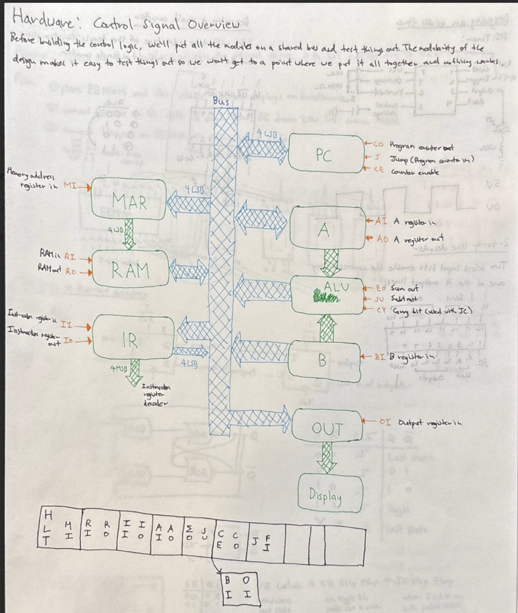
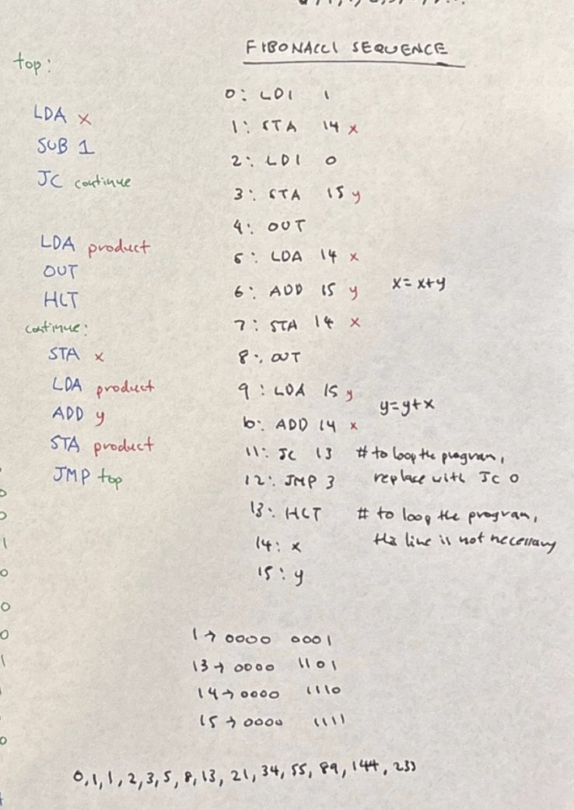

# Building an 8-Bit Computer From Scratch

<video src="https://github.com/user-attachments/assets/05ccfb35-f5f6-4227-bde2-8bf7383773b5" controls width="100%"> </video>

<!--

-->

I’d like to thank Mr. Wang, Charles Petzold, Ben Eater, and my dad for inspiration.  

There are several constraints of this system looking back.  
1. Can’t scale. This computer is stuck to breadboards, wires, and physical registers.  
2. No operating system. Can’t run concurrent programs. People have to program 11010100 manually by hand. One program at a time.   
3. I’m super interested in how an operating system works. The people who designed the architecture for a computer, took upon themselves to think how to make it more functional for people to use. The jump from seeing logic gates to form memory is really creative. But so is going from inputs, memory, ALUs, and outputs and knowing how to arrange them in such a way that gives way to von Neumann architecture is a significant jump in creativity. Computer architecture is very much a lesson in interaction design.  

Lessons: I’ve spent more time debugging this computer than building it. Probably 2-3 times more time debugging and testing and buying new parts for broken or burned pieces than actually building the thing. Because I’m not writing a cpu in verilog, when something breaks, I have to consider: did I wire something to the wrong input/output, did I burn a logic gate inside a chip, is the light not lighting up because the program is wrong or because I didn’t distribute enough power to the breadboard or because the led lights that I bought actually got burnt and I need to get ones with resistors built inside them. Typically, I’ve learned to give up after 2-3 hours of getting nowhere trying to find the bug, and then discover a new way of looking at things the next day when I revisit. I wanted to give up on making this project multiple times (70-80 times).  

Yes, and if I had a choice to make this computer, I would not. It’s wayyy too much work. Just learn to make a cpu in verilog. Why torture yourself in making the wires look neat?  

## The Final Build

*The completed 8-bit computer showing ~200 hand-wired connections, logic gates, LEDs, and 7-segment displays. The display shows "055" - output from a running Fibonacci sequence program.*  

<table>
  <tr>
  <!-- Table head -->
 <thead>
<tr>
  <th>Hardware: Control Signal Overview</th>
  <th>Fibonacci Sequence: Assembly</th>
</tr>
  </thead>
    
  <!-- Table Data -->
<td></td>

<td></td>
  </tr>
</table>

---  

## Technical Specifications

### Hardware constraints

- **RAM:** 4-bit memory address (16 bytes total)
- **Registers:** Program Counter, A-register, B-register, Instruction register
- **ALU:** 8-bit addition and subtraction
- **Control unit:** 2 EEPROMs mapping instructions to control signals
- **Flags:** JMP, JZ (jump if zero), JC (jump if carry) for branching
- **Clock:** Bistable 555 timer (manual/automatic modes)
- **Output:** Three 7-segment displays + LEDs

### Limitations of programs it can run
Multiplication: 6 x 8 = 48. 
Fibonacci sequence 0,1,1,2,3,5,8,13,21,34,55,89,144,233. 
Testing jump/conditional: Counts up to 255. Counts down to 0. Repeat.

Further Reading:
[What I learned from Building a Homemade 8-Bit Breadboard Computer. | Max Zhou](https://www.linkedin.com/pulse/what-i-learned-from-building-homemade-8-bit-breadboard-max-zhou/)
[8-Bit Breadboard Computer | The Shamblog](https://theshamblog.com/8-bit-breadboard-computer/)
